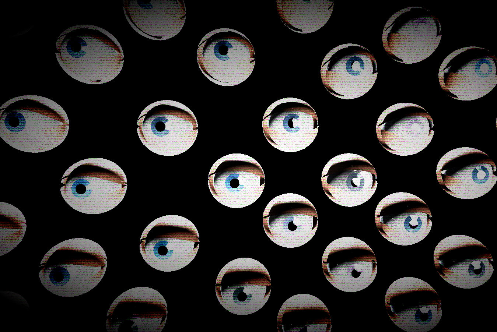

IRIS MATRIX

**Description**
- Iris Matrix is a creepier recreation of the eye exhibit at the WNDR Museum. It was created for the CS 460 course at UMass Boston, taught under Daniel Haehn. It utilizes Three.JS, Blender, HTML, and Javascript.

**Installation**
- To access the project, just use the custom link https://ljdupa.github.io/eye-wall/ to immediately view all of its features!

**Functionaltiy**
- The Iris Matrix allows you to input your own files, where it takes the most prevalent colors and adds them to the eyes' irises. The eyes all blink, and was created (painfully on a Macbook) in Blender!

The audio you hear once you entire the Iris Matrix is a combination of static audio, and this audio from this Youtube Video. https://www.youtube.com/watch?v=xAO3x-Uhfoo

The reroll Colors button just rolls whatever colors you got from the image you selected, and moves them to other irises. 

Have fun! 🙂
